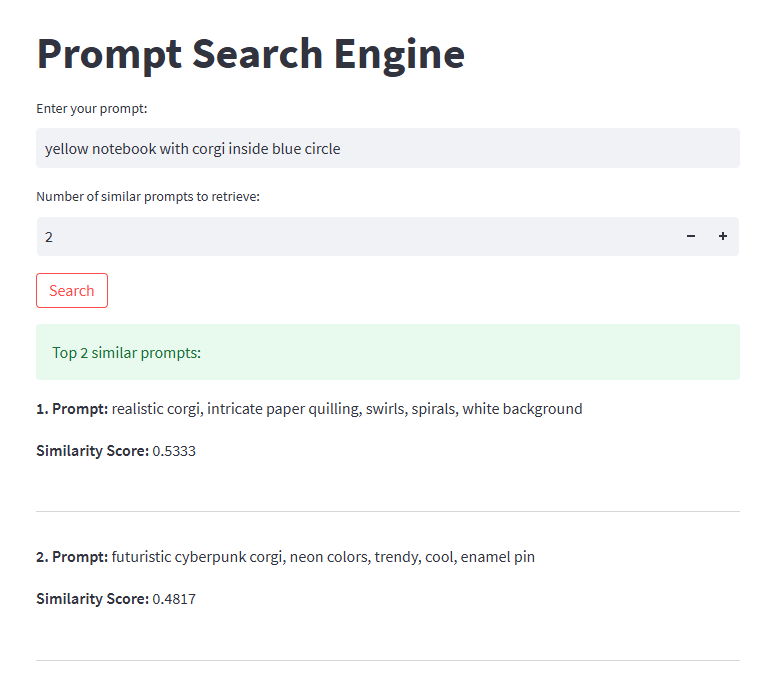

# Prompt Search Engine

## Overview

The **Prompt Search Engine** is an application that allows users to input a query prompt and retrieve the top `n` most similar prompts from a dataset. It uses **Sentence-BERT (SBERT)** for vectorizing prompts and **cosine similarity** to compute prompt similarity.The use case is for Stable Diffusion- search engine  assists in generating better prompts by leveraging a database of existing prompts.These prompts significantly impact the quality and relevance of the generated images.
## Features
- Vectorizes input prompts and dataset prompts using SBERT.
- Computes cosine similarity to find the top `n` most similar prompts.
- Provides a FastAPI-based API for backend.
- Includes a user-friendly frontend built with Streamlit.
  
In this example, we serve an sentence-transformers model using FastAPI for the backend service and streamlit for the frontend service.
Docker compose orchestrates the two services and allows communication between them.
To run the example in a machine running Docker and docker compose, run:

```bash

docker compose build
docker compose up
```
Then go to localhost:8501 on your browser where you can play with your personal prompts for stable diffusion and see how similar they are with corpus prompts.
Playground.py is toy example of how prompt search engine works.
